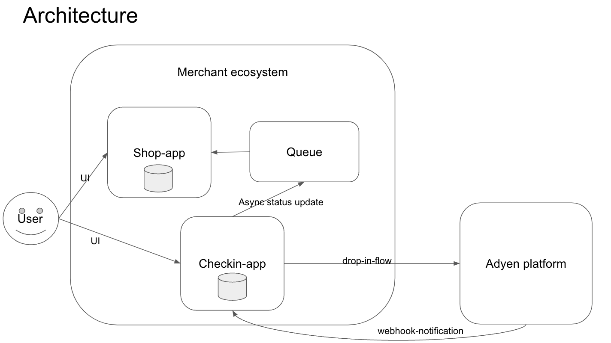

# Example shop that interacts with the Adyen paymnent platform

Little example app that demonstrates how Adyen drop-in checkout works

## Play around with the app

https://marcsexperiment.ew.r.appspot.com/

## Deploy on Google Appengine

    # login in to gcloud to start using the cli
    gcloud auth login 
    gcloud config set project <your-project-name>   
    
    # Prepare a task-queue
    gcloud tasks queues create default --max-attempts=10 --max-concurrent-dispatches=5
    
    cp app.yaml.template app.yaml
    # adjust app.yaml
    gcloud app deploy app.yaml --version version1 --quiet

## Overview of architecture

